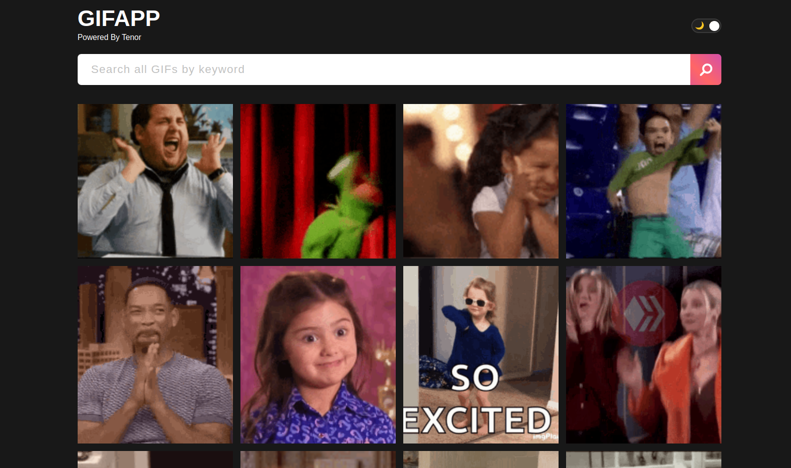
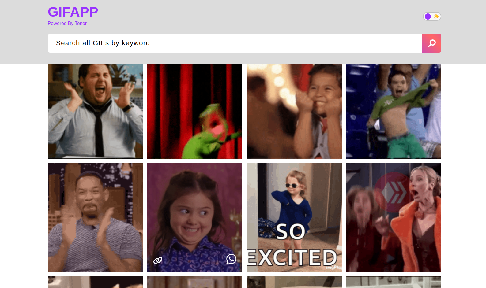

#Frontenders Community

## Challenge #6 - GIF APP

In questa challenge andiamo a creare un'app per cercare delle GIF tramite parole chiave. Per la ricerca utilizzeremo https://tenor.com/gifapi.
Dopo aver inserito la chiave di ricerca e premuto Invio (o cliccato sul pulsante), l'utente potrà visulizzare le gif in una griglia. Attenzione: non vedremo tutte le gif poiché l'API effettua la paginazione dei risultati. Proviamo quindi ad eseguire nuove chiamate api allo scroll della pagina (effetto noto come infinite scroll).

Altre funzionalità del progetto sono:
- possibilità di cambiare tema: light/dark mode switcher;
- possibilità di condividere il link della gif tramite whatsapp;
- possibilità di copiare link in clipboard;
- layout responsive

### Consigli

Questa challenge potrebbe essere realizzata tramite vanilla js, ma sicuramente è più consigliato utilizzare uno dei framework che renderà la struttura del progetto più manutenibile.

Partiamo dalla documentazione https://developers.google.com/tenor/guides/quickstart, quindi ci registriamo in Google Cloud Console e richiediamo API Key per poter accedere al Tenor. Ricordate che le credenziali di accesso non dovrebbero essere publiche e quindi trovate il modo per non condividerli su github. 

**Font**: Roboto
**Icone**: Fontawesome

### Bonus
- Implementa filtro delle gif per categoria.

### Tecnologie

HTML, CSS/SASS.
JS plain o un framework a tua scelta.
CSS plain o una libreria a tua scelta.

### Preview

### Demo:
https://olga-demina-gif-app.netlify.app/

